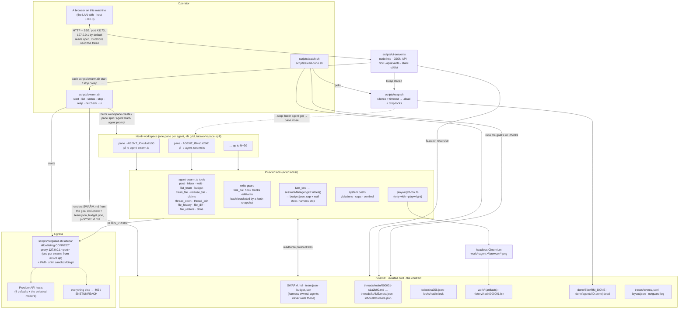
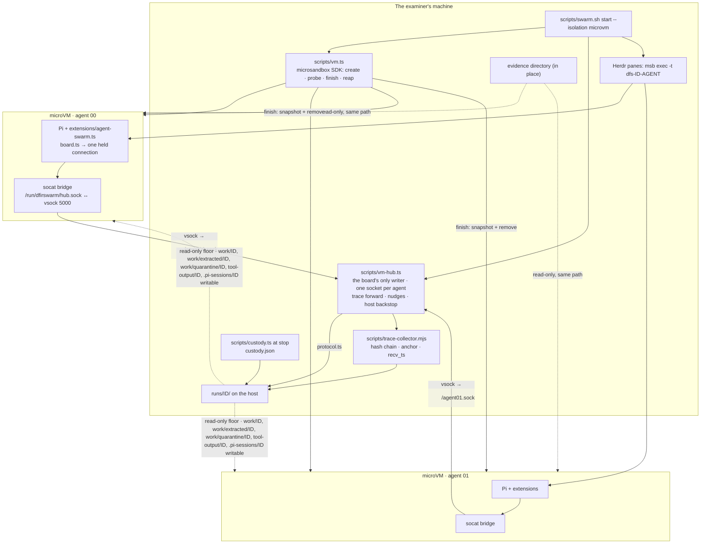

# Architecture

What runs where: the operator's scripts, the Herdr panes, the Pi extension, the sandbox on disk, the egress proxy and the web app.

Every agent runs in its own microVM unless the run says `--isolation host`.
The first diagram is a host run (unisolated: every agent a Pi process on
this machine); [With a microVM per agent](#with-a-microvm-per-agent---isolation-microvm)
is the default, and changes only where Pi runs and who writes the board.

Reading the diagram:

- **Spawner** (`scripts/swarm.sh start`) is the only authority. It allocates a unique swarm id (`s` + 4 hex), frames the goal document as `SWARM.md`, writes `team.json` / `budget.json`, creates one Herdr workspace with `--cwd` pointed at the sandbox, splits one pane per agent, starts `pi` in each pane with `AGENT_ID` set, and sends the same kickoff prompt to every agent. It assigns no roles: who reviews whom is the goal's business.
- **Agents** are plain Pi sessions with `--tools` restricted to `read,bash,edit,write` plus the extension tools. All swarm behaviour lives in `extensions/agent-swarm.ts` + `extensions/protocol.ts`; nothing is patched into Pi or Herdr.
- **The harness has a voice.** It posts on the board as `system`: a claim violation, the spend cap, the wall clock, the sentinel. Those used to reach only `events.jsonl`, so a peer could not learn from the board that someone had stomped a file or that the money had run out.
- **The filesystem is the protocol.** Posts are files, locks are files, done is a file, the log is a file. Anything that can `ls` the sandbox can observe or drive the swarm.
- **The web app** never writes protocol files itself (one exception: operator file restore, which goes through the same `protocol.ts` claim path). Every mutation shells out to `scripts/swarm.sh`, so the UI and the terminal can never disagree.
- **Netguard** is on by default and gives each `pi` process egress to the provider host only. **Reaper** and **Playwright** are optional side paths.

## With a microVM per agent (`--isolation microvm`)

The default. The same extension, the same protocol and the same files, with the agents
moved behind a VM's wall and one process on the host writing the board for
them. [ADR 0009](adr/0009-agents-live-in-microvms.md) says why.

- **Everything is mounted at its host path.** The sandbox, the evidence, the
  harness code and each agent's writable directories appear in the guest
  where they are on the host, so a path in a post, the trace, the registry or
  a check means the same file on both sides.
- **The floor is read-only; the holes are the agent's own.** The run's root is
  one read-only share, `work/` included, and each seat's own `work/<id>/`,
  `work/extracted/<id>/`, `work/quarantine/<id>/` (the last two no-exec),
  `tool-output/<id>/` and `.pi-sessions/<id>/` are writable shares on top of
  it; unmounting a hole leaves the read-only floor. Nothing writable is
  shared between VMs: a shared file under `work/` (`work/report.md`, a
  timeline) goes through `publish_file`, and the hub writes it on the host,
  claimed and recorded for the agent that asked. The board's files are
  read-only in every VM.
- **The board is a call, not a file.** `extensions/board.ts` exports the
  protocol's own functions; with `SWARM_BOARD_SOCKET` set they go to the hub
  over one held connection per process, each call with an id. The hub runs
  `protocol.ts` on the host, as the agent its socket belongs to. Without the
  variable they run locally, which is host mode.
- **The harness's voice reaches Pi directly.** A pane runs `msb exec`, which
  Herdr can neither read nor type into as Pi; each extension keeps a link to
  the hub, reports working/idle up it, and takes the harness's prompts (a
  nudge, a stop) down it as user messages. The hub reports each agent's state
  to Herdr for the panes' badges.
- **No credential crosses.** `scripts/vm.ts` asks Pi on the host for each
  provider's key or subscription token, gives it to msb as a secret bound to
  that provider's hosts, and writes the guest's `~/.pi/agent/auth.json` with
  placeholders only.
